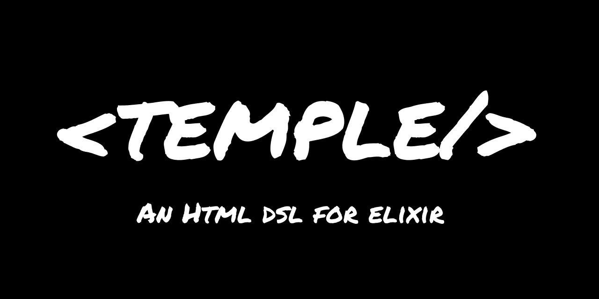

[](https://github.com/mhanberg/temple/actions)
[](https://hex.pm/packages/temple)

> You are looking at the README for the main branch. The README for the latest stable release is located [here](https://github.com/mhanberg/temple/tree/v0.11.0).

# Temple

Temple is an Elixir DSL for writing HTML and SVG.

## Installation

Add `temple` to your list of dependencies in `mix.exs`:

<!-- x-release-please-start-version -->
```elixir
def deps do
  [
    {:temple, "~> 0.14.0"}
  ]
end
```
<!-- x-release-please-end -->

## Goals

Currently Temple has the following things on which it won't compromise.

- Will only work with valid Elixir syntax.
- Should work in all web environments such as Plug, Aino, Phoenix, and Phoenix LiveView.

## Usage

Using Temple is as simple as using the DSL inside of an `temple/1` block. The runtime result of the macro is your HTML.

See the [guides](https://hexdocs.pm/temple/your-first-template.html) for more details.

```elixir
import Temple

temple do
  h2 do: "todos"

  ul class: "list" do
    for item <- @items do
      li class: "item" do
        div class: "checkbox" do
          div class: "bullet hidden"
        end

        div do: item
      end
    end
  end

  script do: """
  function toggleCheck({currentTarget}) {
    currentTarget.children[0].children[0].classList.toggle("hidden");
  }

  let items = document.querySelectorAll("li");

  Array.from(items).forEach(checkbox => checkbox.addEventListener("click", toggleCheck));
  """
end
```

### Components

Temple components are simple to write and easy to use.

Unlike normal partials, Temple components have the concept of "slots", which are similar [Vue](https://v3.vuejs.org/guide/component-slots.html#named-slots). You can also refer to HEEx and Surface for examples of templates that have the "slot" concept.

Temple components are compatible with HEEx and Surface components and can be shared.

Please see the [guides](https://hexdocs.pm/temple/components.html) for more details.

```elixir
defmodule MyAppWeb.Component do
  import Temple

  def card(assigns) do
    temple do
      section do
        div do
          slot @header
        end

        div do
          slot @inner_block
        end

        div do
          slot @footer
        end
      end
    end
  end
end
```

Using components is as simple as passing a reference to your component function to the `c` keyword.

```elixir
import MyAppWeb.Component

c &card/1 do
  slot :header do
    @user.full_name
  end

  @user.bio

  slot :footer do
    a href: "https://twitter.com/#{@user.twitter}" do
      "@#{@user.twitter}"
    end
    a href: "https://github.com/#{@user.github}" do
      "@#{@user.github}"
    end
  end
end
```

### Engine

By default, Temple will use the `EEx.SmartEngine` that is built into the Elixir standard library. If you are a web framework that uses it's own template engine (such as [Aino](https://github.com/oestrich/aino) and Phoenix/LiveView, you can configure Temple to it!

```elixir
# config/config.exs

config :temple,
  engine: Aino.View.Engine # or Phoenix.HTML.Engine or Phoenix.LiveView.Engine
```

### Formatter

To include Temple's formatter configuration, add `:temple` to your `.formatter.exs`.

```elixir
[
  import_deps: [:temple],
  inputs: ["*.{ex,exs}", "priv/*/seeds.exs", "{config,lib,test}/**/*.{ex,exs,lexs}"],
]
```

## Phoenix

When using Phoenix ~> 1.7, all you need to do is include `:temple` in your mix.exs.

If you plan on using the template structure that < 1.6 Phoenix applications use, you can use `:temple_phoenix` as described below.

To use with [Phoenix](https://github.com/phoenixframework/phoenix), please use the [temple_phoenix](https://github.com/mhanberg/temple_phoenix) package! This bundles up some useful helpers as well as the Phoenix Template engine.

## Related

- [Introducing Temple: An elegant HTML library for Elixir and Phoenix](https://www.mitchellhanberg.com/introducing-temple-an-elegant-html-library-for-elixir-and-phoenix/)
- [Temple, AST, and Protocols](https://www.mitchellhanberg.com/temple-ast-and-protocols/)
- [Thinking Elixir Episode 92: Temple with Mitchell Hanberg](https://podcast.thinkingelixir.com/92)
- [How EEx Turns Your Template Into HTML](https://www.mitchellhanberg.com/how-eex-turns-your-template-into-html/)
